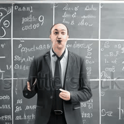

# Video qualitative results
## Real-World Videos(ModelScope)
<table class="center">
<tr>
  <td style="text-align:center;"colspan="4"><b>Without POS</b></td>
</tr>
<tr>
  <td>  </td>
  <td></td>
  <td></td>
  <td></td>
</tr>
<tr>
  <td width=25% style="text-align:center;">"A man is speaking in front of the blackboard"</td>
  <td width=25% style="text-align:center;">"A rabbit is <del>eating a watermelon</del> on the table"</td>
  <td width=25% style="text-align:center;">"A cat with sunglasses is eating a watermelon on the beach"</td>
  <td width=25% style="text-align:center;">"A puppy is eating a cheeseburger on the table, comic style"</td>
</tr>

<tr>
  <td style="text-align:center;"colspan="4"><b>With POS</b></td>
</tr>
<tr>
  <td></td>
  <td></td>
  <td></td>
  <td></td>
</tr>
<tr>
  <td width=25% style="text-align:center;">"A man is speaking in front of the blackboard"</td>
  <td width=25% style="text-align:center;">"A rabbit is <del>eating a watermelon</del> on the table"</td>
  <td width=25% style="text-align:center;">"A cat with sunglasses is eating a watermelon on the beach"</td>
  <td width=25% style="text-align:center;">"A puppy is eating a cheeseburger on the table, comic style"</td>
</tr>
</table>

## UnReal-World Videos(ModelScope)
<table class="center">
<tr>
  <td style="text-align:center;"colspan="4"><b>Without POS</b></td>
</tr>
<tr>
  <td></td>
  <td></td>
  <td></td>
  <td></td>
</tr>
<tr>
  <td width=25% style="text-align:center;">"A rabbit is eating a watermelon on the table"</td>
  <td width=25% style="text-align:center;">"A rabbit is <del>eating a watermelon</del> on the table"</td>
  <td width=25% style="text-align:center;">"A cat with sunglasses is eating a watermelon on the beach"</td>
  <td width=25% style="text-align:center;">"A puppy is eating a cheeseburger on the table, comic style"</td>
</tr>

<tr>
  <td style="text-align:center;"colspan="4"><b>With POS</b></td>
</tr>
<tr>
  <td></td>
  <td></td>
  <td></td>
  <td></td>
</tr>
<tr>
  <td width=25% style="text-align:center;">"A rabbit is eating a watermelon on the table"</td>
  <td width=25% style="text-align:center;">"A rabbit is <del>eating a watermelon</del> on the table"</td>
  <td width=25% style="text-align:center;">"A cat with sunglasses is eating a watermelon on the beach"</td>
  <td width=25% style="text-align:center;">"A puppy is eating a cheeseburger on the table, comic style"</td>
</tr>
</table>

## Real-World Videos(SCVideo)
<table class="center">
<tr>
  <td style="text-align:center;"colspan="4"><b>Without POS</b></td>
</tr>
<tr>
  <td></td>
  <td></td>
  <td></td>
  <td></td>
</tr>
<tr>
  <td width=25% style="text-align:center;">"A rabbit is eating a watermelon on the table"</td>
  <td width=25% style="text-align:center;">"A rabbit is <del>eating a watermelon</del> on the table"</td>
  <td width=25% style="text-align:center;">"A cat with sunglasses is eating a watermelon on the beach"</td>
  <td width=25% style="text-align:center;">"A puppy is eating a cheeseburger on the table, comic style"</td>
</tr>

<tr>
  <td style="text-align:center;"colspan="4"><b>With POS</b></td>
</tr>
<tr>
  <td></td>
  <td></td>
  <td></td>
  <td></td>
</tr>
<tr>
  <td width=25% style="text-align:center;">"A rabbit is eating a watermelon on the table"</td>
  <td width=25% style="text-align:center;">"A rabbit is <del>eating a watermelon</del> on the table"</td>
  <td width=25% style="text-align:center;">"A cat with sunglasses is eating a watermelon on the beach"</td>
  <td width=25% style="text-align:center;">"A puppy is eating a cheeseburger on the table, comic style"</td>
</tr>
</table>

## UnReal-World Videos(SCVideo)
<table class="center">
<tr>
  <td style="text-align:center;"colspan="4"><b>Without POS</b></td>
</tr>
<tr>
  <td></td>
  <td></td>
  <td></td>
  <td></td>
</tr>
<tr>
  <td width=25% style="text-align:center;">"A rabbit is eating a watermelon on the table"</td>
  <td width=25% style="text-align:center;">"A rabbit is <del>eating a watermelon</del> on the table"</td>
  <td width=25% style="text-align:center;">"A cat with sunglasses is eating a watermelon on the beach"</td>
  <td width=25% style="text-align:center;">"A puppy is eating a cheeseburger on the table, comic style"</td>
</tr>

<tr>
  <td style="text-align:center;"colspan="4"><b>With POS</b></td>
</tr>
<tr>
  <td></td>
  <td></td>
  <td></td>
  <td></td>
</tr>
<tr>
  <td width=25% style="text-align:center;">"A rabbit is eating a watermelon on the table"</td>
  <td width=25% style="text-align:center;">"A rabbit is <del>eating a watermelon</del> on the table"</td>
  <td width=25% style="text-align:center;">"A cat with sunglasses is eating a watermelon on the beach"</td>
  <td width=25% style="text-align:center;">"A puppy is eating a cheeseburger on the table, comic style"</td>
</tr>
</table>
  

### Image qualitative results
